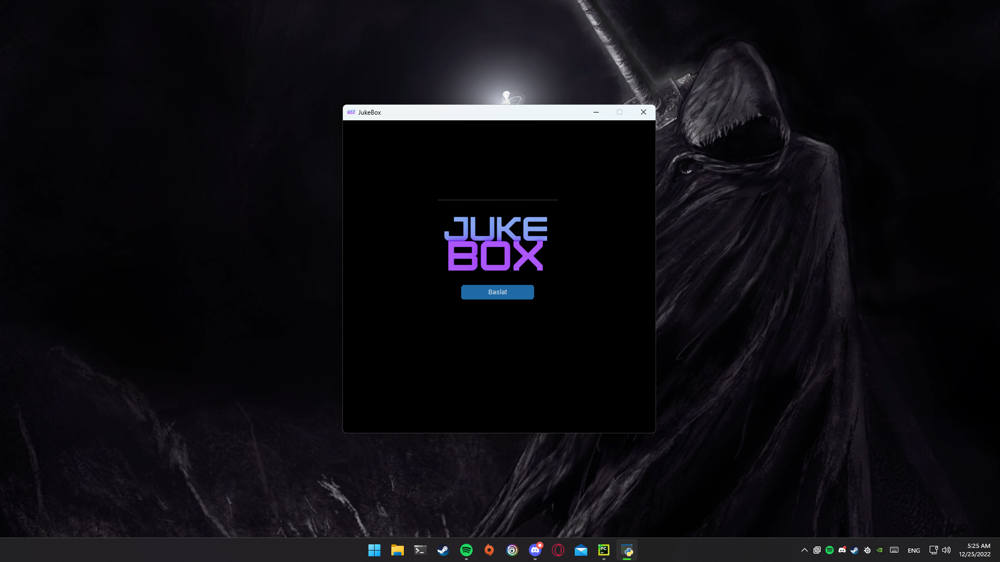
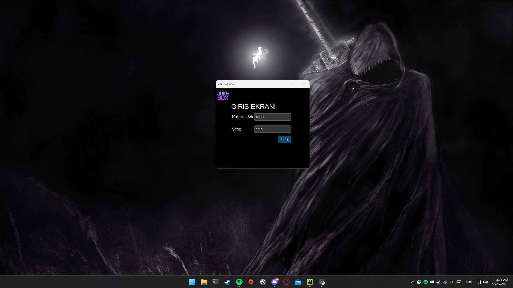
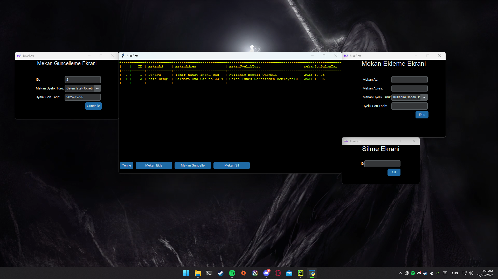

# 🎵 JukeBox 

**JukeBox, müzik yayını yapan mekanlar için geliştirilmiş bir veritabanı yönetim sistemidir. Bu proje, mekanların satın almayı planladıkları müzik paketlerini ve üyelik durumlarını yönetmemize olanak tanır. 

